# Hadice

<p align="center">
  
</p>

<p align="center">
  <strong>Desktop debugging toolkit for Android & HarmonyOS</strong>
</p>

<p align="center">
  <a href="./README.md">中文</a> ·
  <a href="./README_EN.md">English</a> ·
</p>

<p align="center">
  <!-- Replace with GitHub Release / Stars badges -->
  <!--  -->
  <!--  -->
</p>

Hadice is an open-source project from **Huolala**. It is a cross-platform desktop app built with [Wails v3](https://wails.io/). Connect **HarmonyOS Next** and **Android** devices over USB or wireless debugging to do performance monitoring, app management, file transfer, screen mirroring & recording, network capture, AI automation, and more — all from your computer.

> **iOS support is being rolled out gradually** — stay tuned.

---

## Screenshots

<table>
  <tr>
    <td align="center" width="50%">
      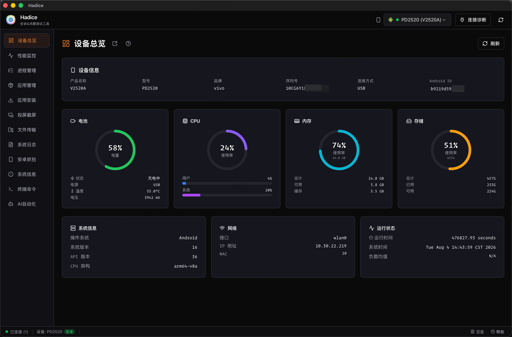
      <br />
      <b>Device overview</b>
      <br />
      <sub>Battery, CPU, memory, storage, and system info</sub>
    </td>
    <td align="center" width="50%">
      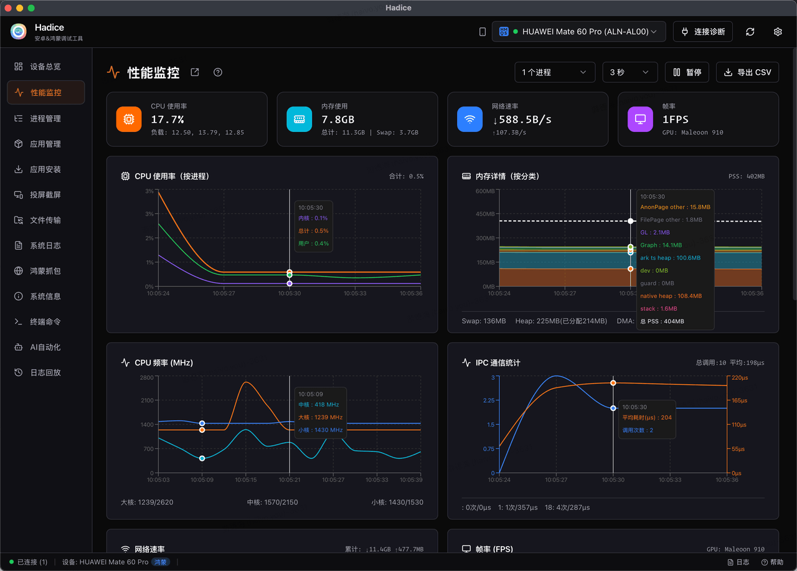
      <br />
      <b>Performance</b>
      <br />
      <sub>CPU / memory / network / FPS charts with export</sub>
    </td>
  </tr>
  <tr>
    <td align="center" width="50%">
      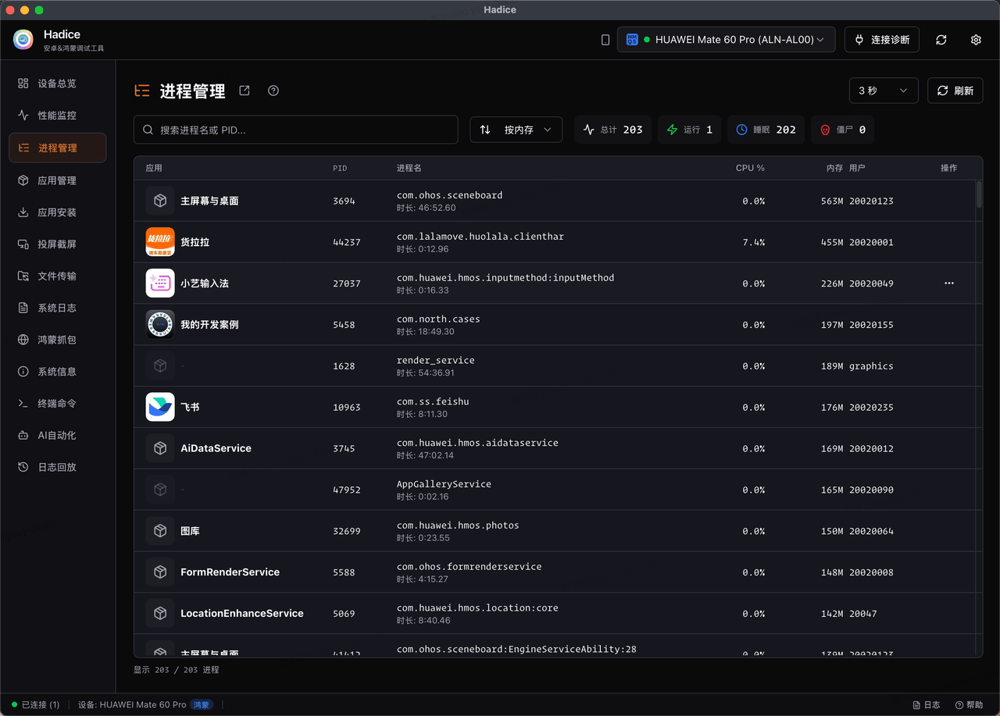
      <br />
      <b>Process manager</b>
      <br />
      <sub>Sort by CPU / memory, search, and kill processes</sub>
    </td>
    <td align="center" width="50%">
      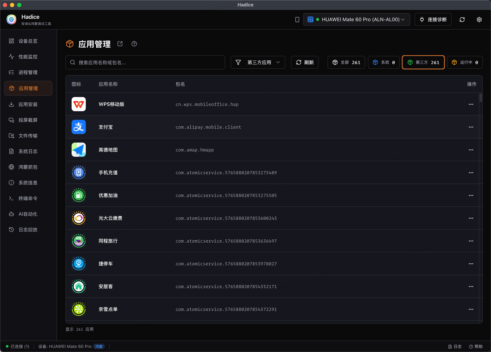
      <br />
      <b>App manager</b>
      <br />
      <sub>Start, stop, uninstall, and clear app data</sub>
    </td>
  </tr>
  <tr>
    <td align="center" width="50%">
      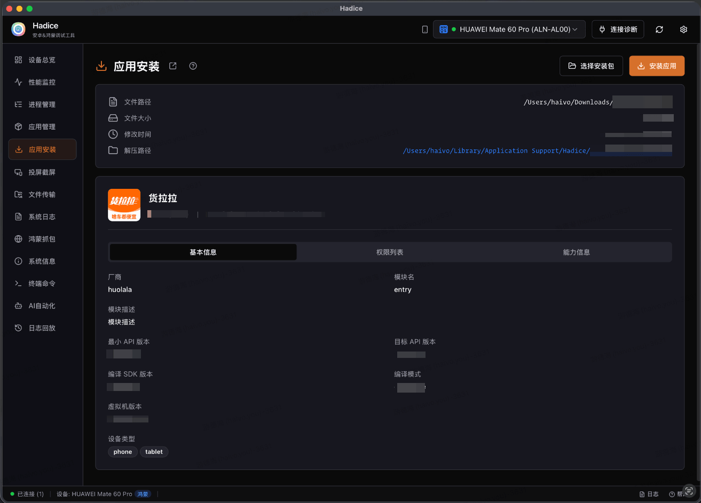
      <br />
      <b>App install</b>
      <br />
      <sub>Drag-and-drop or pick APK / HAP to install quickly</sub>
    </td>
    <td align="center" width="50%">
      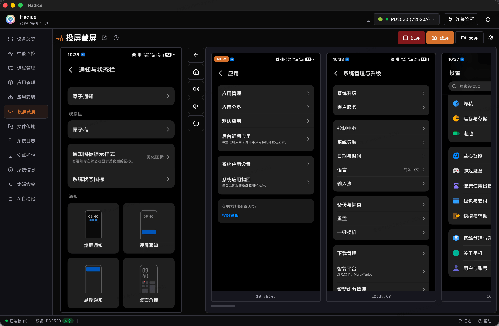
      <br />
      <b>Screen mirror</b>
      <br />
      <sub>Live mirror, screenshot, record, and history</sub>
    </td>
  </tr>
  <tr>
    <td align="center" width="50%">
      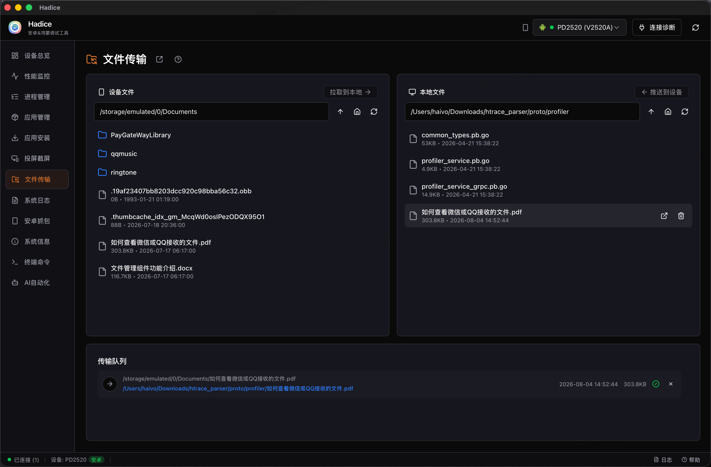
      <br />
      <b>File transfer</b>
      <br />
      <sub>Bidirectional transfer with batch queue</sub>
    </td>
    <td align="center" width="50%">
      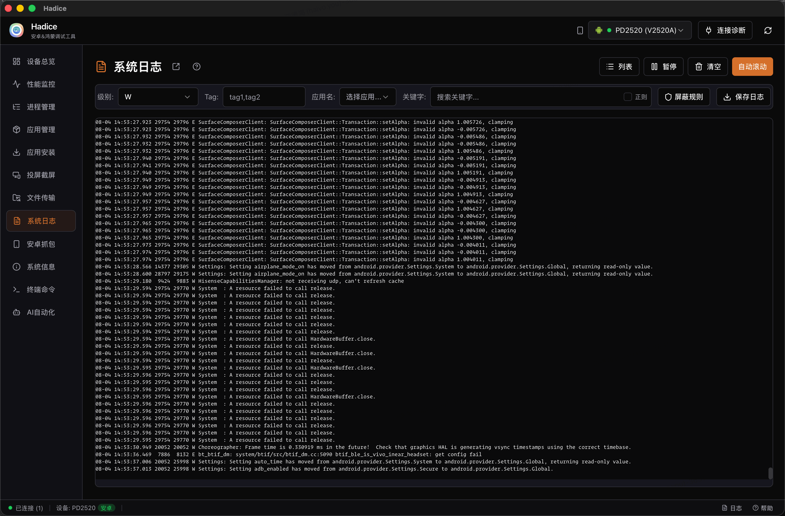
      <br />
      <b>System logs</b>
      <br />
      <sub>Live hilog / logcat with filter and save</sub>
    </td>
  </tr>
  <tr>
    <td align="center" width="50%">
      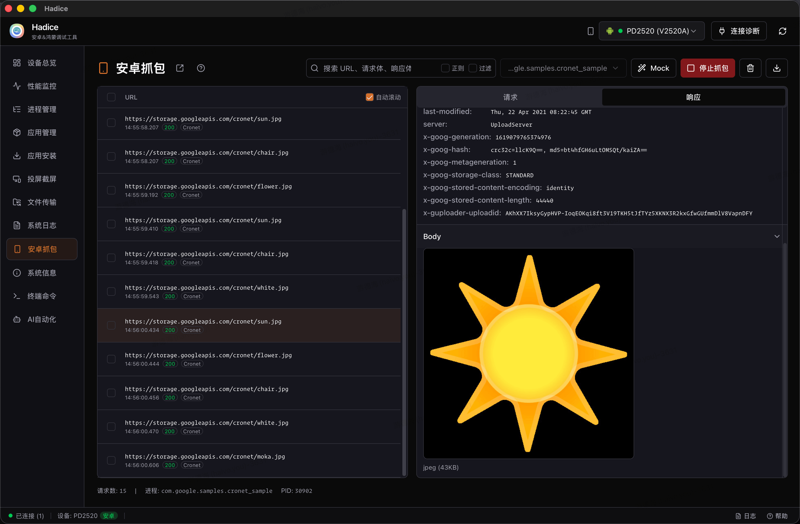
      <br />
      <b>Network capture</b>
      <br />
      <sub>HarmonyOS / Android capture, detail preview, Mock, and export</sub>
    </td>
    <td align="center" width="50%">
      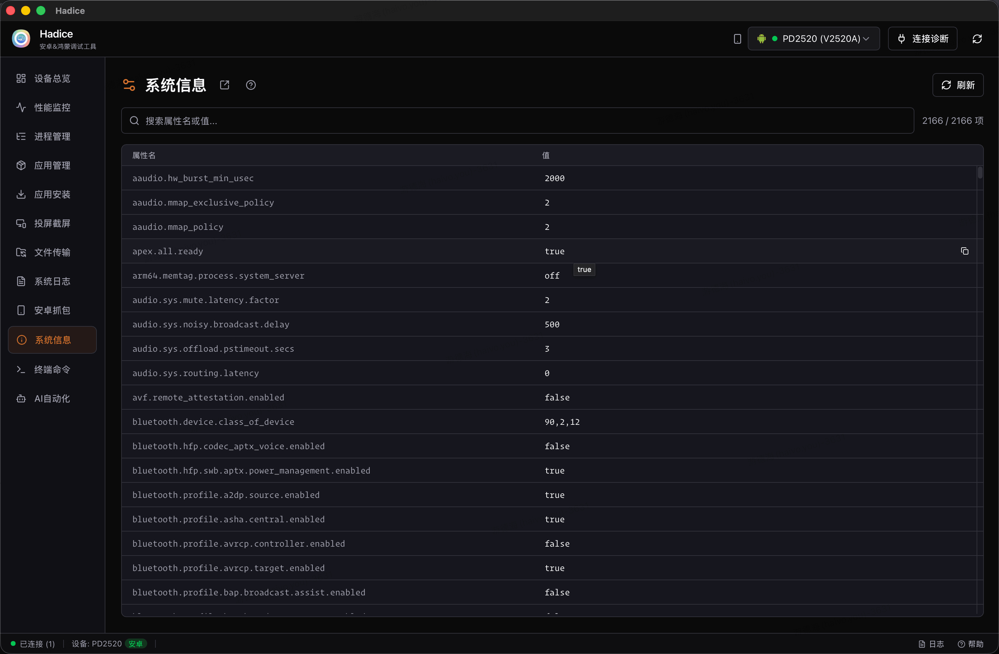
      <br />
      <b>System info</b>
      <br />
      <sub>Browse and search device system properties</sub>
    </td>
  </tr>
  <tr>
    <td align="center" width="50%">
      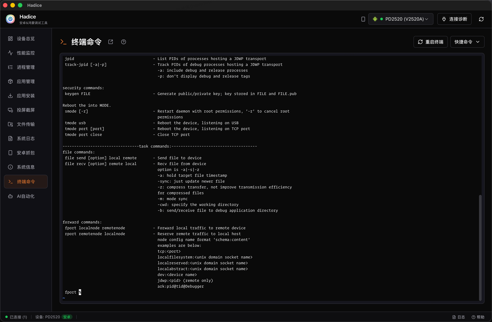
      <br />
      <b>Terminal</b>
      <br />
      <sub>HDC / ADB Shell and local terminal</sub>
    </td>
    <td align="center" width="50%">
      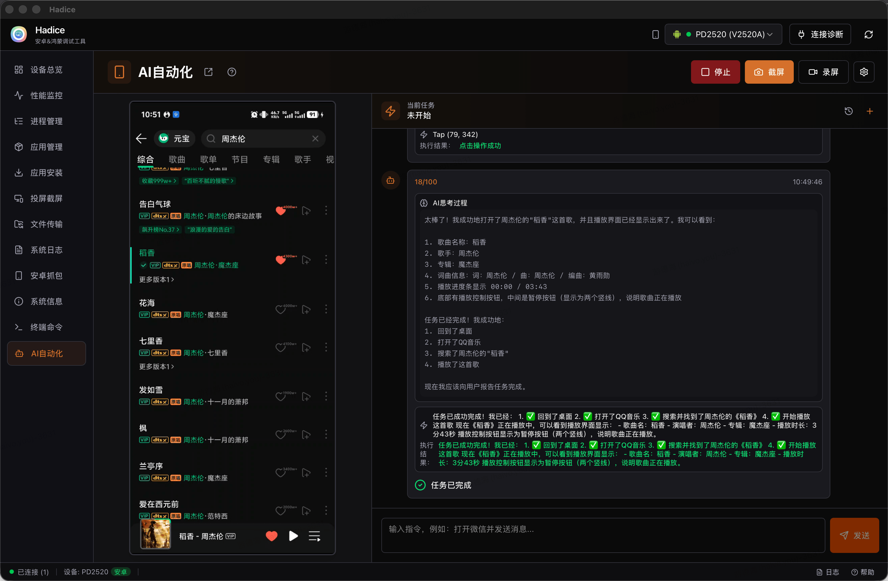
      <br />
      <b>AI automation</b>
      <br />
      <sub>Vision- and instruction-driven device automation</sub>
    </td>
  </tr>
</table>

---

## Download & install

### macOS

1. Download the DMG for your platform from [GitHub Releases](../../releases).
2. Install the app
   - Double-click the downloaded DMG
   - Drag `Hadice.app` into the Applications folder
3. The build is **unsigned**. Before the first launch, run the following in Terminal (**required**, otherwise macOS may say it “cannot be opened” or is “damaged”):
   - Open Terminal
   - Run:

```bash
sudo xattr -dr com.apple.quarantine /Applications/Hadice.app
```

   - Enter your Mac login password and press Return
   - Open Hadice again

### Windows

1. Download the exe installer from [GitHub Releases](../../releases).
2. Follow the installer wizard. If SmartScreen warns about an unknown app, choose **Run anyway**.

---

## Getting started

1. Enable Developer Mode on your phone

   • HarmonyOS: Settings → About phone → Software version — tap “Software version” 7 times, then go back to Settings → System → Developer options, and enable Developer options and USB debugging

   • Android: Settings → About phone — tap “Build number” 7 times, then go back to Settings → Developer options, and enable USB debugging

2. USB connection

   Connect the phone to the computer with a USB cable

3. Refresh devices

   • Click the refresh icon in the top-right of the app

   • On the phone, allow USB debugging for this computer

   • If connection fails, use **Connection diagnosis**

## Feature guide

- Each menu title has a help button on the right — click it for detailed usage tips

<p align="left">
  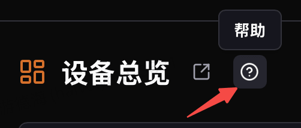
</p>

- Each menu can be opened in a separate window for parallel use

<p align="left">
  
</p>

---

## Build from source

### Requirements

| Dependency | Notes |
|------------|--------|
| Go | 1.24+ |
| Node.js | 20+ recommended (with npm) |
| [Task](https://taskfile.dev/) | Build task runner |
| [Wails v3 CLI](https://wails.io/) | `go install github.com/wailsapp/wails/v3/cmd/wails3@latest` |
| Android NDK + JDK | Required to build the Android capture agent (`task build` / `task dev`). NDK 25.2.9519653 |

### Clone & setup

```bash
git clone https://github.com/HuolalaTech/hadice.git
cd hadice

# Frontend dependencies
cd frontend && npm install && cd ..

# (Optional) config: analytics / update check / docs URL, etc.
cp .env.ci.example .env.ci
```

### Development

```bash
task dev
```

### Build & package

| Command | Description |
|---------|-------------|
| `task build:agent` | Build Android Agent only (needs NDK + JDK) |
| `task build` | Build for the current platform |
| `task build:macos:arm64` | macOS Apple Silicon |
| `task build:macos:amd64` | macOS Intel |
| `task build:windows:amd64` | Windows AMD64 |
| `task build:cross` | Full cross-platform build |
| `task package:macos:arm64` | Package macOS ARM64 DMG |
| `task package:cross` | Package all platforms |
| `task gen:version` | Generate `backend/version.go` from `build/config.yml` |
| `task gen:cienv` | Bake `.env.ci` into `backend/cienv_generated.go` (never ship the file) |
| `task clean` | Clean `bin/` and agent artifacts |
| `task clean:dist` | Clean `dist/` |

Output directory: `dist/{platform}-{arch}/`.

### Version

Single source of truth: `build/config.yml` → `info.version`. Builds sync it into artifact names and the runtime version.

```yaml
info:
  version: "2.3.0"
```

### Project layout (brief)

```text
.
├── main.go            # Entry; embeds frontend assets
├── backend/           # Go backend (Wails Service, hdc/adb, capture, …)
├── frontend/          # React + Vite + Tailwind
├── agent/             # Android JVMTI capture agent sources (build output not committed)
├── assets/            # Platform tool binaries (hdc, adb, scrcpy, …)
├── build/             # Wails / Task build config
├── docs/              # Technical docs and screenshots
├── .env.ci.example    # Private config template (do not commit a real .env.ci)
├── AGENTS.md          # Repo map for AI / contributors
├── README.md          # Chinese README (default)
└── README_EN.md       # This file
```

## Contributing

Issues and Pull Requests are welcome. See [CONTRIBUTING.md](./CONTRIBUTING.md).

For security reports, see [SECURITY.md](./SECURITY.md). For usage help, see [SUPPORT.md](./SUPPORT.md).

---

## License

Hadice is an open-source project from **Huolala** and is released under the [Apache License 2.0](./LICENSE).

Copyright © 2026 深圳依时货拉拉科技有限公司

Attribution and licenses for redistributed third-party native binaries are listed in [assets/NOTICE](./assets/NOTICE) and the root [NOTICE](./NOTICE).

## Author / Attribution

- Publisher: 货拉拉 ([HuolalaTech/hadice](https://github.com/HuolalaTech/hadice))
- Code of conduct: [CODE_OF_CONDUCT.md](./CODE_OF_CONDUCT.md)

---

<p align="center">
  Made with ❤️ for Android & HarmonyOS developers
</p>
